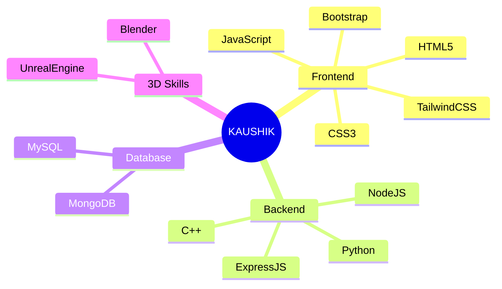

<div align="center">

```ascii
  ╔══════════════════════════════════════════════════════════════╗
  ║                                                              ║
  ║   🎮 PLAYER 1                                               ║
  ║   KAUSHIK VISHWAKARMA                                       ║
  ║   [ DEVELOPER MODE ACTIVATED ]                              ║
  ║                                                              ║
  ╚══════════════════════════════════════════════════════════════╝
```


</div>

---

<table>
<tr>
<td width="50%">

### 📌 QUICK STATS
```python
class Developer:
    def __init__(self):
        self.name = "Kaushik Vishwakarma"
        self.role = "Full Stack Developer"
        self.art = "3D Modeler"
        self.language = ["Python", "JavaScript", "C++"]
        self.learning = ["ExpressJS", "Blender"]
        
    def say_hi(self):
        print("Making the digital world more interesting...")

me = Developer()
me.say_hi()
```

</td>
<td width="50%">

### 🎯 CURRENT QUEST
```javascript
// Loading next mission...
const currentMission = {
  mainQuest: "Master ExpressJS",
  sideQuest: "Create Amazing 3D Models",
  completion: "▓▓▓▓▓▓░░░░░ 60%",
  nextMilestone: "Building Interactive 3D Web Apps"
}
```

</td>
</tr>
</table>

<div align="center">

```ascii
  ╔══════════════════════════════════════════════════════════════╗
  ║                                                              ║
  ║   🎮 PLAYER 1                                               ║
  ║   KAUSHIK VISHWAKARMA                                       ║
  ║   [ DEVELOPER MODE ACTIVATED ]                              ║
  ║                                                              ║
  ╚══════════════════════════════════════════════════════════════╝
```


</div>

---

<table>
<tr>
<td width="50%">

### 📌 QUICK STATS
```python
class Developer:
    def __init__(self):
        self.name = "Kaushik Vishwakarma"
        self.role = "Full Stack Developer"
        self.art = "3D Modeler"
        self.language = ["Python", "JavaScript", "C++"]
        self.learning = ["ExpressJS", "Blender"]
        
    def say_hi(self):
        print("Making the digital world more interesting...")

me = Developer()
me.say_hi()
```

</td>
<td width="50%">

### 🎯 CURRENT QUEST
```javascript
// Loading next mission...
const currentMission = {
  mainQuest: "Master ExpressJS",
  sideQuest: "Create Amazing 3D Models",
  completion: "▓▓▓▓▓▓░░░░░ 60%",
  nextMilestone: "Building Interactive 3D Web Apps"
}
```

</td>
</tr>
</table>

<div align="center">

## 💻 SKILL TREE UNLOCKED



</div>

## 🏆 ACHIEVEMENTS

<table>
<tr>
<td width="50%">

### COMBAT STATS


</td>
<td width="50%">

### SKILL POINTS


</td>
</tr>
</table>

<div align="center">

## 🌐 MULTIPLAYER ZONE

[](https://www.linkedin.com/in/kaushik-vish)
[](https://instagram.com/unreal_kaushik)
[](mailto:vkaushik13804@gmail.com)

```ascii
⠀⠀⠀⠀⠀⠀⠀⠀⠀⠀⠀GAME SAVE POINT⠀⠀⠀⠀⠀⠀⠀⠀⠀⠀
┊　　┊　　┊　　┊　　┊
┊　　┊　　┊　　┊　　★
┊　　┊　　┊　　☆　　┊
┊　　┊　　★　　┊　　┊
┊　　☆　　┊　　┊　　┊
★　　┊　　┊　　┊　　┊
```

### 🎮 SECRET FACT
"They say the Earth is flat... but my 3D models aren't! 🌍"

</div>

## 🛠️ TOOLS OF THE TRADE

<div align="center">


</div>

---

<div align="center">

### 🌟 CURRENT QUEST STREAK 🌟
[](https://git.io/streak-stats)


```ascii
PRESS START TO CONNECT
```

</div>

## 🏆 ACHIEVEMENTS

<table>
<tr>
<td width="50%">

### COMBAT STATS


</td>
<td width="50%">

### SKILL POINTS


</td>
</tr>
</table>

<div align="center">

## 🌐 MULTIPLAYER ZONE

[](https://www.linkedin.com/in/kaushik-vish)
[](https://instagram.com/unreal_kaushik)
[](mailto:vkaushik13804@gmail.com)

```ascii
⠀⠀⠀⠀⠀⠀⠀⠀⠀⠀⠀GAME SAVE POINT⠀⠀⠀⠀⠀⠀⠀⠀⠀⠀
┊　　┊　　┊　　┊　　┊
┊　　┊　　┊　　┊　　★
┊　　┊　　┊　　☆　　┊
┊　　┊　　★　　┊　　┊
┊　　☆　　┊　　┊　　┊
★　　┊　　┊　　┊　　┊
```

### 🎮 SECRET FACT
"They say the Earth is flat... but my 3D models aren't! 🌍"

</div>

## 🛠️ TOOLS OF THE TRADE

<div align="center">


</div>

---

<div align="center">

### 🌟 CURRENT QUEST STREAK 🌟
[](https://git.io/streak-stats)


```ascii
PRESS START TO CONNECT
```

</div>
