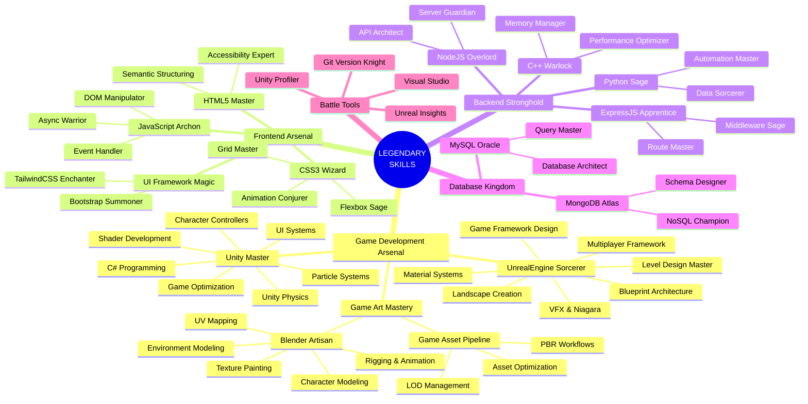

[Previous header section remains the same until the QUICK STATS]

### 📌 QUICK STATS
```python
class GameDeveloper:
    def __init__(self):
        self.name = "Kaushik Vishwakarma"
        self.role = "Game Developer & Full Stack Dev"
        self.art = "3D Modeler"
        self.engines = ["Unity", "Unreal Engine"]
        self.language = ["C#", "Python", "JavaScript", "C++"]
        self.learning = ["Unity Game Dev", "Character Animation"]
        
    def say_hi(self):
        print("Crafting virtual worlds and interactive experiences...")

me = GameDeveloper()
me.say_hi()
```

### 🎯 CURRENT QUEST
```javascript
// Loading next mission...
const currentMission = {
  mainQuest: "Master Unity Game Development",
  sideQuest: "Create Character Animation Systems",
  completion: "▓▓▓▓▓▓░░░░░ 60%",
  nextMilestone: "Publishing First Unity Game",
  techStack: "Unity + C# + Blender"
}
```

[Previous table structure remains the same]



[Previous sections remain the same until TOOLS OF THE TRADE]

## 🛠️ TOOLS OF THE TRADE

<div align="center">


</div>

[Rest of the sections remain the same]
