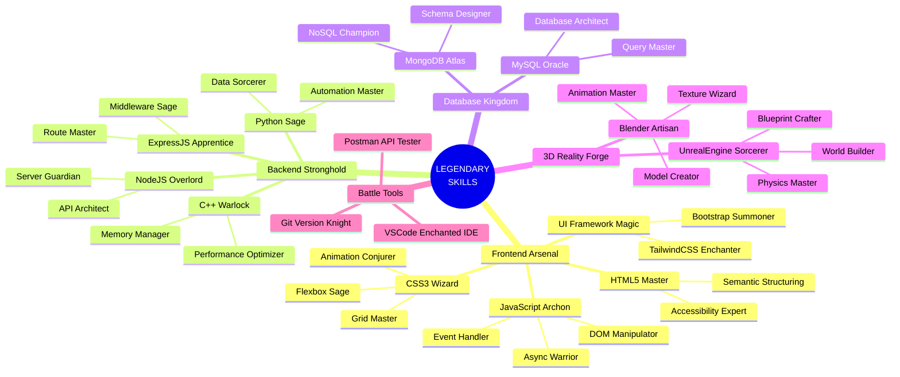

<div align="center">

```ascii
  ╔══════════════════════════════════════════════════════════════╗
  ║                                                              ║
  ║   🎮 PLAYER ONE FOUND                                       ║
  ║   KAUSHIK VISHWAKARMA                                       ║
  ║   [ LEGENDARY DEVELOPER MODE: ACTIVATED ]                    ║
  ║   [ CLASS: FULL-STACK WARRIOR | SPECIALIZATION: 3D ARTIST ] ║
  ║                                                              ║
  ╚══════════════════════════════════════════════════════════════╝
```


</div>

---

<table>
<tr>
<td width="50%">

### 📌 CHARACTER STATS
```python
class LegendaryDeveloper:
    def __init__(self):
        self.name = "Kaushik Vishwakarma"
        self.class_type = "Full Stack Warrior"
        self.specialization = "3D Battle Mage"
        self.power_languages = ["Python", "JavaScript", "C++"]
        self.current_quests = ["ExpressJS", "Blender"]
        self.special_ability = "Code-Art Fusion"
        
    def battle_cry(self):
        print("Transforming imagination into digital reality...")

hero = LegendaryDeveloper()
hero.battle_cry()
```

</td>
<td width="50%">

### 🎯 ACTIVE QUEST LOG
```javascript
// Loading epic mission details...
const epicQuest = {
  mainMission: "Mastering the ExpressJS Saga",
  sideMission: "Crafting Legendary 3D Artifacts",
  questProgress: "▓▓▓▓▓▓░░░░░ 60%",
  epicReward: "Full-Stack Sorcery + 3D Mastery",
  questStatus: "In Progress - Grinding XP"
}
```

</td>
</tr>
</table>

<div align="center">

## 🌟 SKILL TREE OF LEGENDS 🌟



</div>

## 🏆 BATTLE STATISTICS

<table>
<tr>
<td width="50%">

### COMBAT ACHIEVEMENTS


</td>
<td width="50%">

### POWER DISTRIBUTION


</td>
</tr>
</table>

<div align="center">

## 🌐 MULTIPLAYER REALM

[](https://www.linkedin.com/in/kaushik-vish)
[](https://instagram.com/unreal_kaushik)
[](mailto:vkaushik13804@gmail.com)

```ascii
⠀⠀⠀⠀⠀⠀⠀⠀⠀⠀CHECKPOINT REACHED⠀⠀⠀⠀⠀⠀⠀⠀⠀
┊　　┊　　┊　　┊　　┊
┊　　┊　　┊　　┊　　⚔️
┊　　┊　　┊　　🛡️　　┊
┊　　┊　　⚔️　　┊　　┊
┊　　🛡️　　┊　　┊　　┊
⚔️　　┊　　┊　　┊　　┊
```

### 🎮 LEGENDARY SCROLL
"In a world of flat-earthers, I craft dimensions! 🌍✨"

</div>

## ⚔️ ARSENAL OF POWER

<div align="center">


</div>

---

<div align="center">

### ⚔️ VICTORY STREAK ⚔️
[](https://git.io/streak-stats)


```ascii
[PRESS START TO JOIN PARTY]
```

</div>
